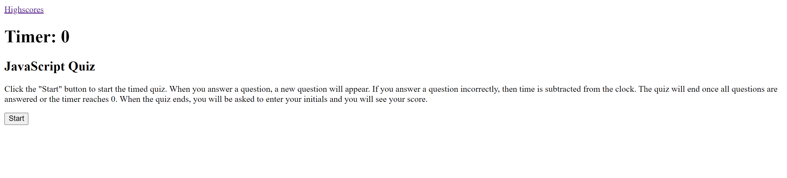

# JavaScript Quiz

## Description

This repository is where I created a timed quiz with multiple-choice questions about JavaScript.

## Installation

N/A

## Usage

[Deployed website] (https://mmmatson.github.io/javascript-quiz/)

Click the "Start" button to start the timed quiz. When you answer a question, a new question will appear. If you answer a question incorrectly, then time is subtracted from the clock. The quiz will end once all questions are answered or the timer reaches 0. When the quiz ends, you will be asked to enter your initials and you will see your score.

## Credits

N/A

## License

See repository for license information.